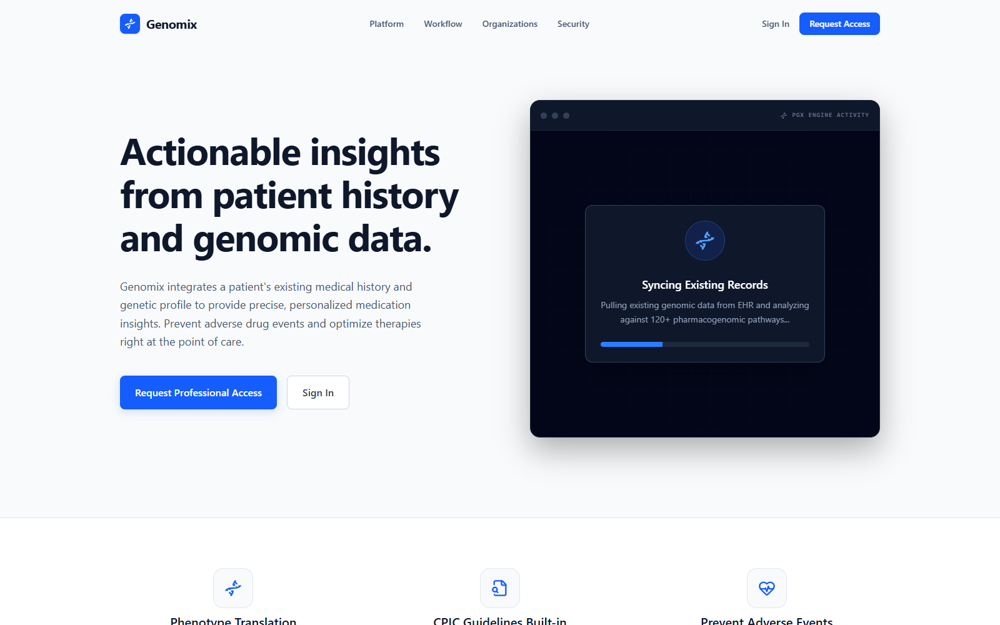
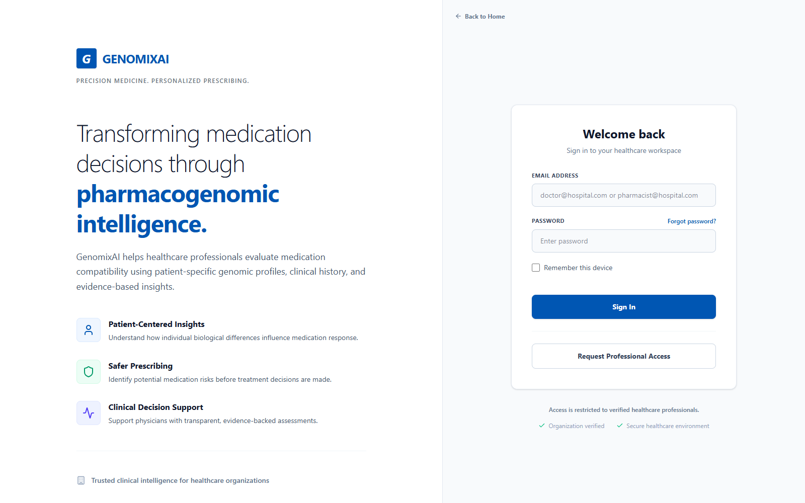
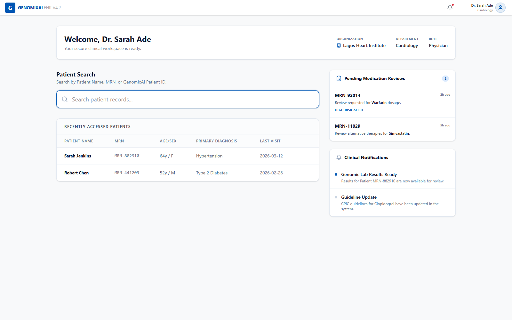
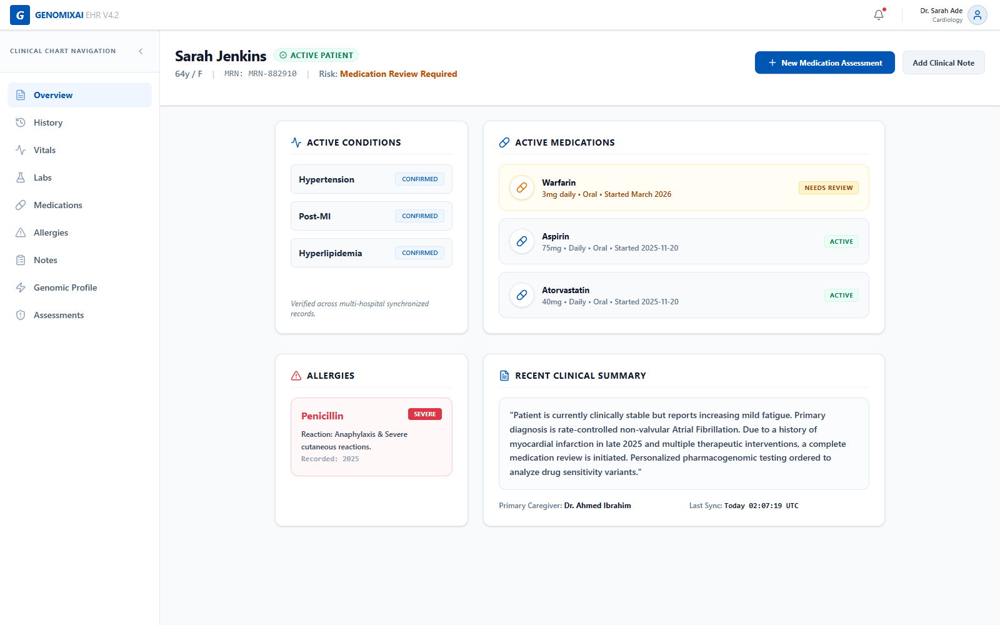
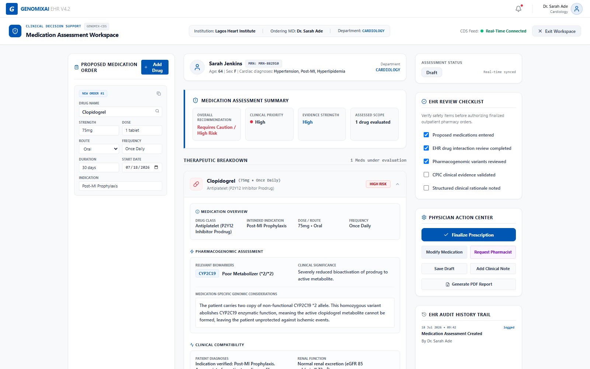
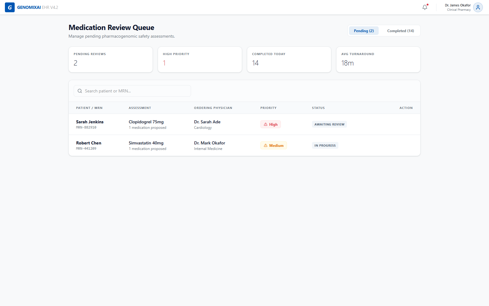
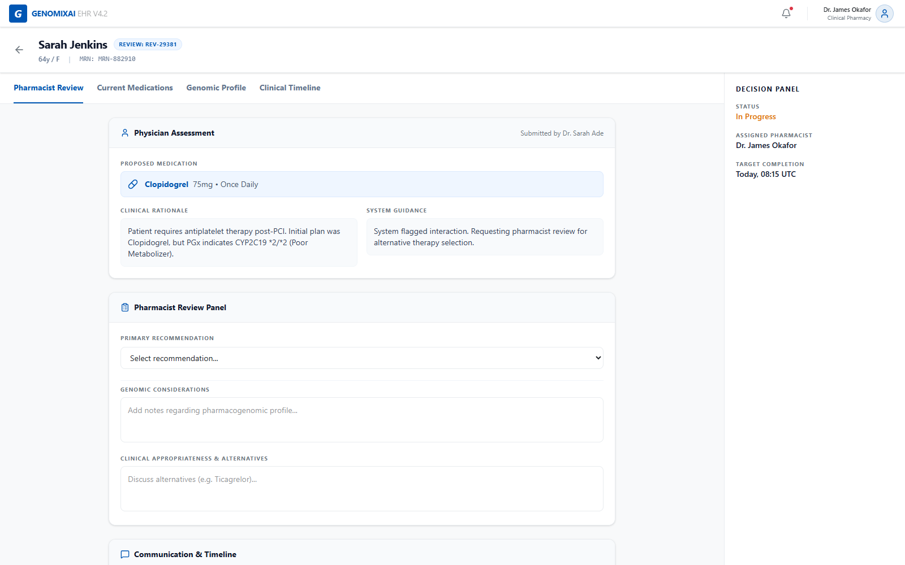

# GenomixAI

## Smarter medication decisions for modern care teams.

GenomixAI is a healthcare platform that helps physicians and clinical pharmacists make safer, more personal medication decisions.

It brings together the information care teams need in one clear workspace:

- a patient’s medical history
- current conditions and medications
- pharmacogenomic information
- clinical notes and laboratory results
- evidence to support the next decision

The goal is simple: help healthcare professionals understand the patient in front of them, spot medication risks earlier, and choose treatment with greater confidence.

GenomixAI is designed for hospitals, clinics, pharmacies, and other healthcare organizations. It is a professional clinical workspace—not a consumer health app.

## What it helps care teams do

### See the whole patient

Find the right patient quickly and view their history, conditions, medications, allergies, labs, notes, and genomic profile in one place.

### Make more informed medication choices

Review how a patient’s unique genomic profile may affect medication response, alongside their existing clinical history.

### Keep physicians and pharmacists connected

Physicians can prepare medication decisions, while clinical pharmacists can review, assess, and provide a clear recommendation when extra review is needed.

### Keep decisions grounded in evidence

GenomixAI keeps the underlying patient information, genomic results, and clinical interpretation distinct, so care teams can understand where an insight came from.

## Product tour

### Welcome to GenomixAI

The platform opens with a calm, focused workspace built around actionable patient insights.

### One professional sign-in

Care teams use one secure entry point. GenomixAI recognizes the user and their healthcare workspace automatically.

### Physician dashboard

Physicians can search patient records, see their organization and department, and keep track of medication reviews and clinical notifications.

### Patient chart

The patient chart brings the most important clinical context together: active conditions, medications, allergies, and recent notes.

### Medication assessment

Medication decisions can be reviewed against the patient’s history and pharmacogenomic information before a prescription is finalized.

### Pharmacist review queue

Clinical pharmacists get a clear view of medication assessments waiting for review, including priority and patient context.

### Pharmacist review

The review workspace gives pharmacists the information they need to document considerations, suggest alternatives, and communicate a decision back to the care team.

## Built around better care

GenomixAI is being shaped around the people who make medication decisions every day—physicians, pharmacists, and healthcare organizations. Every part of the experience is intended to make complex information easier to understand and meaningful at the point of care.

> Better context. Safer decisions. More personal care.

## Project status

GenomixAI is an active product build. The current experience includes the core healthcare workspace, organization-based access, patient identity and search, clinical records, pharmacogenomic profiles, medication orders, and pharmacist review workflows.

